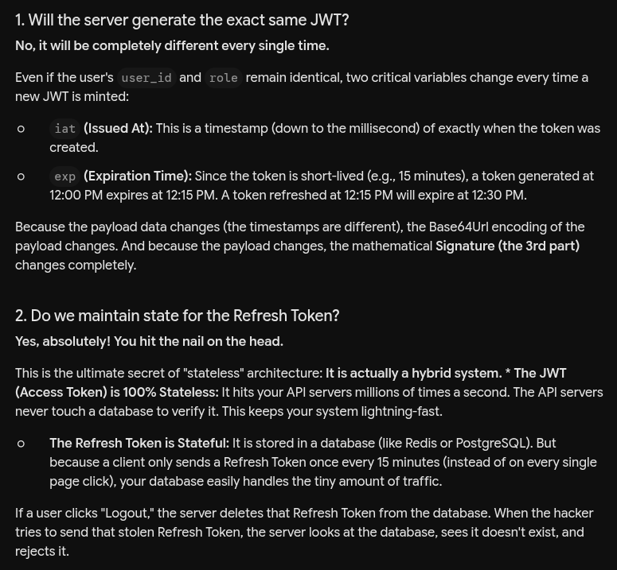

# Authentication

In the user facing B2C applications mainly there are 2 basic types of Auths
1. Stateful: Here server store the each user info attached with session id and return that session id to user back.
2. Stateless: Here the id is capable to decode the user info, server do not need to store user details.

### Common step for both the Auth types
1. ***User first register themselves with all the required fields. This registration details are stored in the DB of the application***
2. User enter the credentials that are securely transferred from user to server through **Https** SSL/TLS encryption.
3. Server now checks the login credentials user has passed are correct or not by cross-checking with the DB. And this is how server know which user is this.

## Stateful
**Login**

1. Now the server generates some random but unique session-id that is longer, unpredictable and encrypted
    - Modern servers use a **CSPRNG (Cryptographically Secure Pseudo-Random Number Generator)**. This relies on unpredictable data from the server's operating system (like microscopic variations in CPU temperature or keystroke timings) to generate true randomness.
    - A long random string: E.g., a **32-byte** or **64-byte** string, which is then converted into letters and numbers (Hexadecimal or Base64) so it can be sent in a cookie safely. (e.g., `a8f3b2c9e7d1...`)
    - A UUID (Universally Unique Identifier): Specifically, a UUIDv4. This is a standard format for a 128-bit random number that looks like this: `123e4567-e89b-12d3-a456-426614174000`.
2. This `id` along with necessary user info like `username`, `role` are been stored in the Authentication database, so to refer the info to know the access of the resources when the user requests something
3. These old dead-id are been identified by the expiry time, and the db is cleaned-up by TTL in Redis/memcache and CRON jobs in the postgres like db.

**After login each time use**

4. This session-id is been shared with the user inside their browser cookies and they sends this session-id with each request. Now for each request there is a DB lookup to get the authenticity & authority of the session-id and user-info.
5. Now this data is used to serve the user.

**Limitations**
1. If this session-id is stored at server layer then 
    - In case of horizontal scaling and load balancer throwing request to any server, user needs to login again and again
    - **Sticky Sessions (Session Affinity):** Lets say load balancer is modeled to send same user to same server what if that server crashes, or what if the server gets overwhelmed
    - There is another way to have common in-memory DB between servers. bcz if there are large set of users, each will have some set of requests, postgres like DB might crash bcz of heavy read.

**C. Challenges of Stateful Scaling**

**Storage Overhead:** If you have 10 million active users, you must store 10 million session strings in memory. This becomes expensive.

**Network Latency:** Every single API call requires an extra internal trip across the network from your App Server to your Redis cluster to look up the session.

**Single Point of Failure (SPOF):** If your Redis session cluster goes down, your entire system's authentication layer collapses, and every single user is kicked out.

## Stateless (Most common one is JWT)

1. Login user sends the `Username` and `password` and server verifies with DB that is this details correct.
2. If yes then it will create a JWT token and return that token to the user
3. Now each time the user want to request something user will again send the token to the server and server decodes & verify the validity of the token and respond accordingly

### Why JWT is stateless then?
1. JWT token consists of tree section `XXXXX.XXXXX.XXXXX`
    - 1st part is base64 encoding of the header of the token i.e. it contains the info like which encryption algo is been used and so on.
    - 2nd part is base64 encoding of the body this usually contains the info related to the user like
        - `username`, `role`, `is_admin`, `etc`, `etc`
        - This is the enough information for server to know who the user is and what they can do
    
    Till here all the things are base64 incoded meaning this info is accessible to anyone and it do not matter because we just keep the public data in here **see here is no sensitive info like password etc**

    - **Now how it is secure?** -> This is secure because of 3rd part of the token
    - 3rd part is the signature 
    - It is a combination of base64 of 1st part + base64 of 2nd part + and It runs them through a hashing algorithm (like HMAC SHA-256) along with your server's Secret.
    - The result is the Signature.

- Now as the payload is just the base64 string so hacker can change the data like access-permission of user and so on, and manipulate the token.
- But even if the user changed the data, the 3rd part of the token is now corrupted and it can become correct only if the secret is same. or else the token is considered as invalid

### **Why cannot some hacker first offline brute-force the secret as if the hacker gets it they can manipulate the token as they want and grant all access to the user and can destroy system?**
However, industry standards dictate that a JWT secret must be a Cryptographically Secure Pseudo-Random string of at least 256 bits (32 bytes).

**A proper secret looks like this:**\
`8f4e2b9c7a1d3f5e6b8c9a0d2e4f6b7c9a1d3e5f7b9c0a2d4e6f8b0c2a4d6e8f`

**The Math That Stops Hackers:**\
If a server uses a 32-byte random hexadecimal string as a secret, the number of possible combinations is astronomical. Even if a hacker commanded a supercomputer capable of checking 100 billion combinations per second, it would take them billions of times longer than the current age of the universe to guess it.

The math simply makes brute-forcing a strong key impossible with current computing power.

## Downsides and fallback strategy for JWT 

### What if the token is stolen?
1. As it is stateless we cannot delete the access of that token from the server's DB. So hacker can access the resources.
#### Solutions: 
1. Less expiration time -> so less time for hacker to access.
2. But now the user has to login again and again
3. So we have **Refresh token:** along with JWT token
4. Work of refresh token in to generate the access tokens again and again when it expires.
5. Logic is simple when the access token expires -> 401 then frontend sends refresh token and server generates the access token again and return both tokens back.

### But if we give both the tokens to user get stolen? 
1. Now hacker can generate access token for longer time.

#### Solution:
1. We will introduce the state here where we store the refresh tokens in the DB. 
2. We can store it in normal DB just because the access is not that frequent as when the access token fails the refresh token is been accessed soo...
3. Whenever user logout then we delete the refresh token so no again verification can be done. still the user has the access until the JWT do not expires

### User can invalidate the token only if they know that token was compromised or else not.
### We can make it more secure by generating new refresh token along with new JWT and share that to the user. So even if someone gets the refresh token

