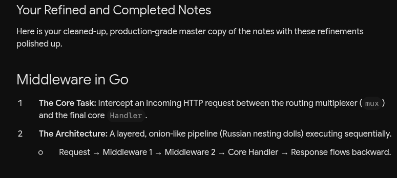
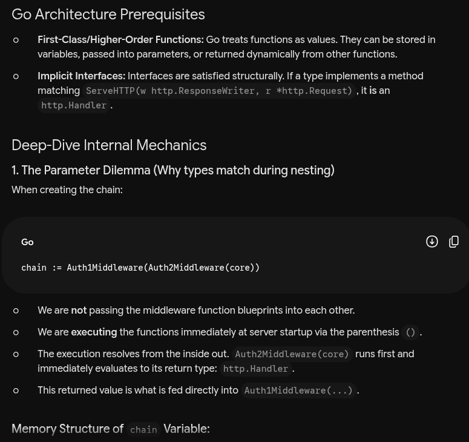
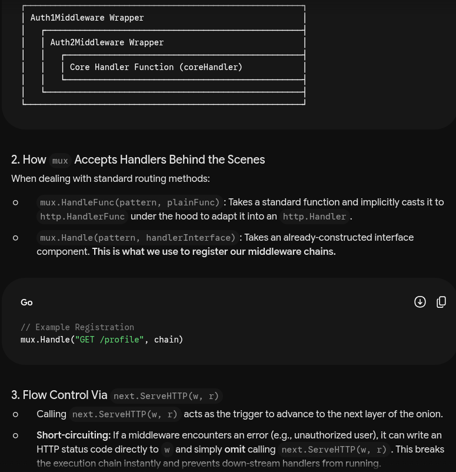

# Middleware

1. **The Core Task:** Intercept an incoming HTTP request between the routing multiplexer (mux) and the final core Handler.

2. **The Architecture:** A layered, onion-like pipeline (Russian nesting dolls) executing sequentially.
`Request → Middleware 1 → Middleware 2 → Core Handler → Response flows backward.`

## How do we implement such middleware in the Go architecture

1. We know the First Class/ Higher order function in Go
- Where the function can be assigned to the variable
- Function can be passed as a param to the function
- Function can be returned from a function

2. When some type implements all the methods from some type it is implicitly considered as a interface

```Go 
package main

import (
	"fmt"
	"net/http"
	"net/http/httptest"
)

// This is your "fun1" (the final core handler)
func coreHandler(w http.ResponseWriter, r *http.Request) {
	fmt.Println(" -> Core Handler Executed!")
}

// This is your "fun2" (The inner middleware)
func Auth2Middleware(next http.Handler) http.Handler {
	fmt.Println("Setup: Auth2Middleware Factory Running")
	
	return http.HandlerFunc(func(w http.ResponseWriter, r *http.Request) {
		fmt.Println("Exec: Auth2 Checking Request...")
		next.ServeHTTP(w, r) // Calls whatever is next in line
	})
}

// This is your "fun3" (The outer middleware)
func Auth1Middleware(next http.Handler) http.Handler {
	fmt.Println("Setup: Auth1Middleware Factory Running")
	
	return http.HandlerFunc(func(w http.ResponseWriter, r *http.Request) {
		fmt.Println("Exec: Auth1 Checking Request...")
		next.ServeHTTP(w, r) // Calls whatever is next in line
	})
}

func main() {
	// 1. Convert coreHandler into an http.Handler
	core := http.HandlerFunc(coreHandler)

	fmt.Println("--- STARTING SETUP (Inside-Out) ---")

	// 2. Build the chain just like: fun3(fun2(core))
	// Auth2Middleware(core) runs FIRST, then its result goes into Auth1Middleware
	chain := Auth1Middleware(Auth2Middleware(core))

	fmt.Println("--- SERVER BOOT COMPLETE ---")
	fmt.Println("")

	// 3. Simulating an incoming HTTP Request hitting our chain
	fmt.Println("--- HTTP REQUEST ARRIVES (Outside-In) ---")
	r := httptest.NewRequest("GET", "http://example.com/foo", nil)
	w := httptest.NewRecorder()
	
	chain.ServeHTTP(w, r)
}
```
```bash
--- STARTING SETUP (Inside-Out) ---
Setup: Auth2Middleware Factory Running
Setup: Auth1Middleware Factory Running
--- SERVER BOOT COMPLETE ---

--- HTTP REQUEST ARRIVES (Outside-In) ---
Exec: Auth1 Checking Request...
Exec: Auth2 Checking Request...
 -> Core Handler Executed!
```

## Internal working of this. Confusion clarification

### 1. All the middleware are expecting the `http.Handler` type but we are passing middleware
- Look in the chain we are executing the middleware while creating the chain.
- This means we are getting the return value of that function inside the **`middleware(#here)`** when we are building the chain itself.
- And return type is `http.Handler`
- This is just happening because we are **executing** all the middleware during creation of **chain**.
```Go
	chain := Auth1Middleware(Auth2Middleware(core))
```
```
┌────────────────────────────────────────────────────────┐
│ Auth1Middleware Wrapper                                │
│   ┌────────────────────────────────────────────────────┤
│   │ Auth2Middleware Wrapper                            │
│   │   ┌────────────────────────────────────────────────┤
│   │   │ Core Handler Function (coreHandler)            │
│   │   └────────────────────────────────────────────────┤
│   └────────────────────────────────────────────────────┤
└────────────────────────────────────────────────────────┘
```
This is the structure of code in the **`chain`** 

### 2. How is our local declared type Handler is matching the http.Handler in the **routers** `mux.HandleFunc("GET /", h.GetUser)`

- This is because the `mux.HandleFunc()` internally type caste our function to the type of `HandlerFunc` 
- Now this `HandlerFunc` has this method called `ServeHTTP` which is the only method in the `type http.Handler` so now our function implements the `http.Handler`  as this is done in Go implicitly.

- Now this type makes the server call our custom handler function pass the `request` and receive `response` from the function `serveHttp`.


### Now as we need the request and response to get modified as required and pass on to the functions we use the `next.ServeHTTP(w, r)` 





